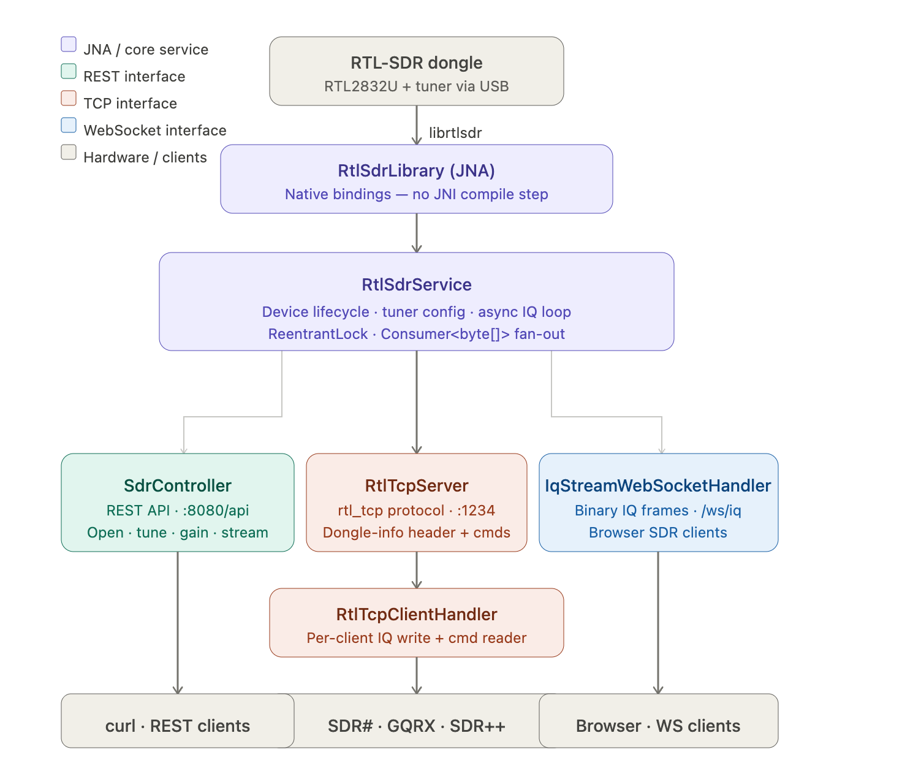
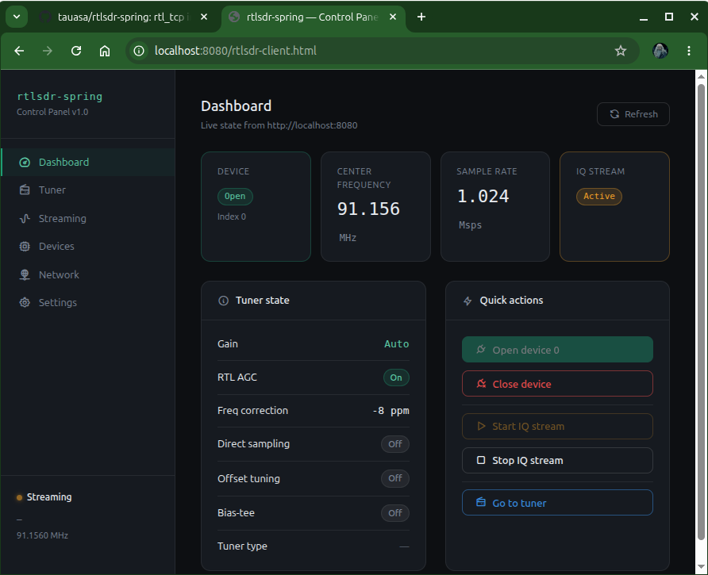
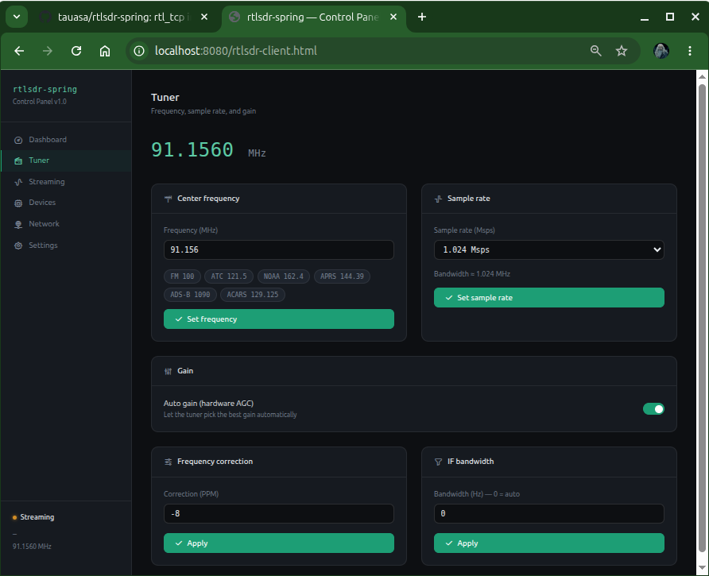
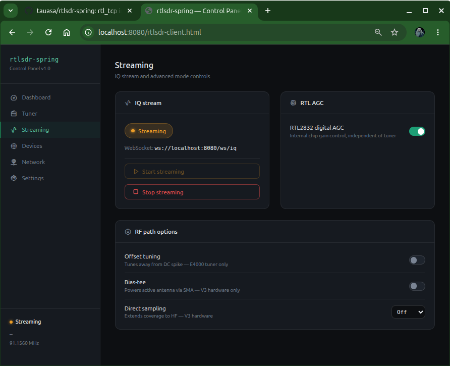
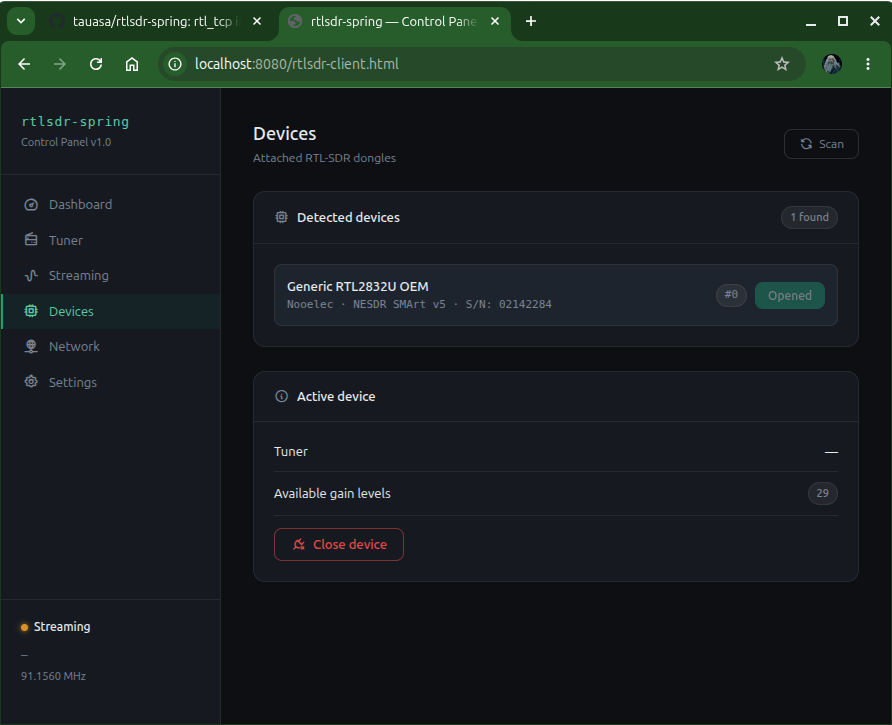
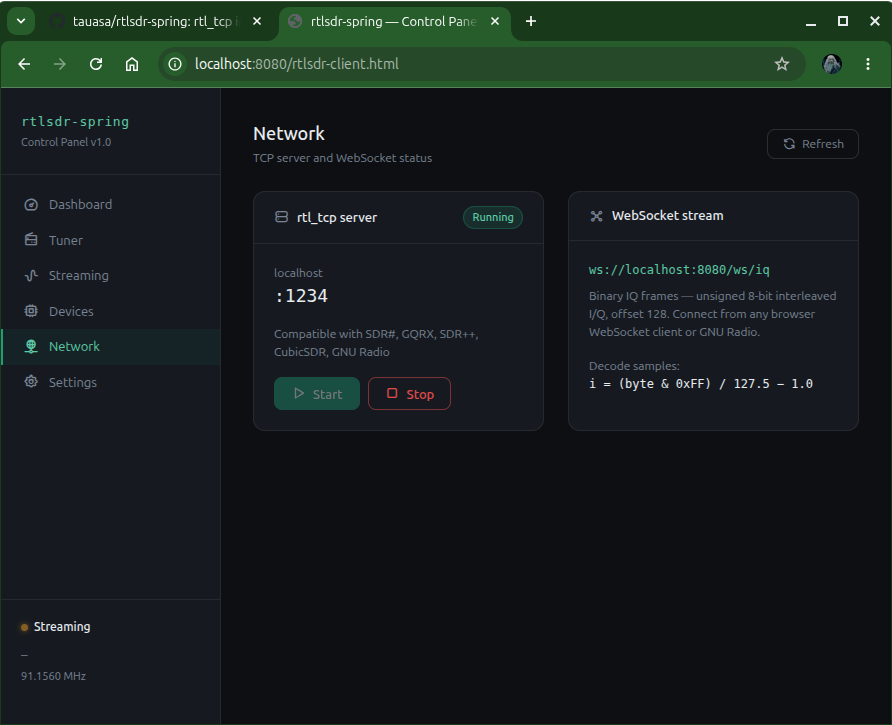
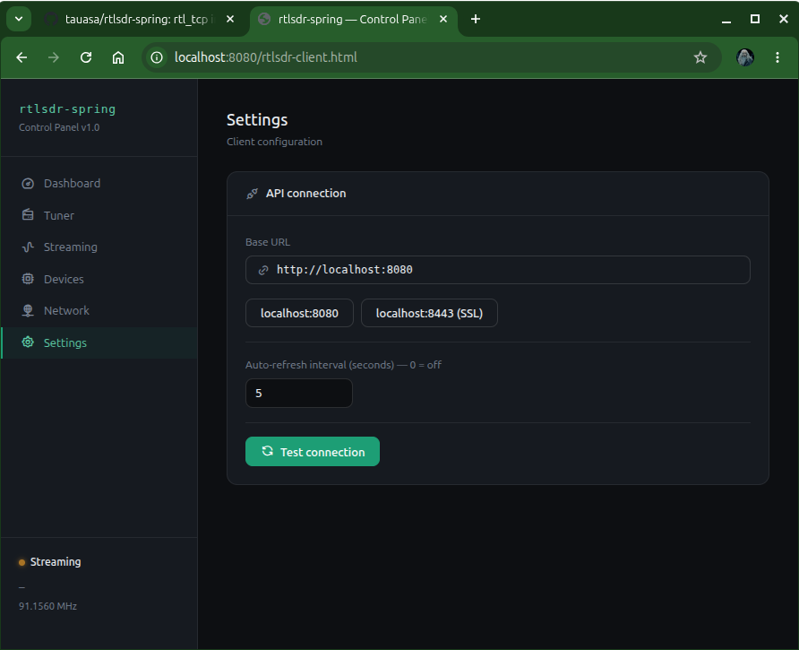

# rtlsdr-spring

A **Java 21 / Spring Boot 4** implementation of `rtl_tcp` — control your RTL-SDR
dongle over a REST API, WebSocket IQ stream, and the original rtl\_tcp wire protocol,
all from a single JVM process.

---

## Architecture



---

## Prerequisites

### 1. Install librtlsdr

**Linux (Debian/Ubuntu)**
```bash
sudo apt install librtlsdr-dev rtl-sdr
# Blacklist the default DVB kernel driver so librtlsdr owns the USB device
echo 'blacklist dvb_usb_rtl28xxu' | sudo tee /etc/modprobe.d/rtlsdr.conf
sudo modprobe -r dvb_usb_rtl28xxu
```

**macOS (Homebrew)**
```bash
brew install librtlsdr
```

**Windows**
1. Install [Zadig](https://zadig.akeo.ie/) and replace the device driver with WinUSB.
2. Download `rtlsdr.dll` from the [osmocom release](https://ftp.osmocom.org/binaries/windows/rtl-sdr/) and place it next to the JAR.

### 2. Java 21

```bash
java -version   # must be 21+
```

---

## Build & Run

```bash
mvn clean package
java -jar target/rtlsdr-spring-1.0.0.jar
```

Or via Spring Boot Maven plugin:
```bash
mvn spring-boot:run
```

Or via the bash startup script:
```bash
# Start app in the foreground (CRTRL-C to quit)
./rtlsdr-spring.sh
```
Other startup script options

```bash
./rtlsdr-spring.sh             Start in foreground (Ctrl+C to stop)
./rtlsdr-spring.sh start       Start in background
./rtlsdr-spring.sh stop        Graceful shutdown
./rtlsdr-spring.sh restart     Stop then start
./rtlsdr-spring.sh status      Show running state and PID
./rtlsdr-spring.sh log [N]     Tail log file (default last 50 lines)

Environment variables:
JAVA_HOME         Java installation directory
RTLSDR_JAR        Path to the JAR (default: ./target/rtlsdr-spring-1.0.0.jar)
RTLSDR_LIB_DIR    Path to librtlsdr directory (default: OS search path)
RTLSDR_LOG_DIR    Log directory (default: /var/log/rtlsdr-spring)RTLSDR_PID_FILE   PID file path (default: /var/run/rtlsdr-spring.pid)
SPRING_PROFILE    Spring active profile (default: default)
JVM_XMS           JVM initial heap (default: 64m)
JVM_XMX           JVM max heap (default: 256m)
EXTRA_JVM_OPTS    Additional JVM flags
```

### Open a device on startup

Edit `application.yml`:
```yaml
rtlsdr:
  device-index: 0          # open device 0 automatically
  tcp-auto-start: true     # bind :1234 on startup
```

---

## REST API

All endpoints return JSON. Base URL: `http://{host}{port}/api`

| Method | Path | Description |
|--------|------|-------------|
| `GET`  | `/devices` | List all attached RTL-SDR dongles |
| `GET`  | `/device/state` | Full state snapshot |
| `POST` | `/device/open` | Open device `{"index":0}` |
| `POST` | `/device/close` | Close device |
| `PUT`  | `/device/frequency` | Set center freq `{"hz":100000000}` |
| `PUT`  | `/device/sample-rate` | Set sample rate `{"hz":2048000}` |
| `PUT`  | `/device/gain` | Set manual gain `{"tenthsDb":200}` (20.0 dB) |
| `PUT`  | `/device/gain-mode` | Auto/manual `{"enabled":true}` |
| `PUT`  | `/device/agc` | RTL2832 AGC `{"enabled":false}` |
| `PUT`  | `/device/freq-correction` | PPM `{"ppm":0}` |
| `PUT`  | `/device/direct-sampling` | Mode 0/1/2 `{"mode":0}` |
| `PUT`  | `/device/offset-tuning` | `{"enabled":false}` |
| `PUT`  | `/device/bias-tee` | `{"enabled":false}` |
| `PUT`  | `/device/bandwidth` | IF bandwidth Hz `{"hz":0}` (0=auto) |
| `POST` | `/device/stream/start` | Begin IQ streaming |
| `POST` | `/device/stream/stop` | Stop streaming |
| `GET`  | `/tcp/status` | TCP server state |
| `POST` | `/tcp/start` | Start TCP server |
| `POST` | `/tcp/stop` | Stop TCP server |

### Quick example (curl)

```bash
# List devices
curl http://localhost:8080/api/devices

# Open device 0
curl -s -X POST http://localhost:8080/api/device/open \
  -H 'Content-Type: application/json' -d '{"index":0}'

# Tune to NOAA weather radio (162.400 MHz)
curl -s -X PUT http://localhost:8080/api/device/frequency \
  -H 'Content-Type: application/json' -d '{"hz":162400000}'

# Start streaming
curl -s -X POST http://localhost:8080/api/device/stream/start
```

---

## rtl\_tcp Protocol (port 1234)

Connect any `rtl_tcp`-aware client ([SDR#](https://airspy.com/download/), [GQRX](https://www.gqrx.dk), [SDR++](https://www.sdrpp.org), [GNU Radio](https://www.gnuradio.org)) to
`localhost:1234`. The server speaks the identical binary protocol:

1. **On connect**: server sends 12-byte dongle-info header  
   `'R','T','L','0'` + tuner-type (4 B BE) + gain-count (4 B BE)
2. **Server → client**: continuous raw IQ bytes (unsigned 8-bit, offset 128)
3. **Client → server**: 5-byte command packets `[cmd_id (1B)][param (4B BE)]`

| Cmd | ID | Parameter |
|-----|----|-----------|
| SET_FREQUENCY | 0x01 | Hz (uint32) |
| SET_SAMPLE_RATE | 0x02 | Hz (uint32) |
| SET_GAIN_MODE | 0x03 | 0=auto, 1=manual |
| SET_GAIN | 0x04 | tenths dB |
| SET_FREQ_CORRECTION | 0x05 | PPM |
| SET_IF_STAGE_GAIN | 0x06 | hi-byte=stage, lo-word=gain |
| SET_AGC_MODE | 0x08 | 0/1 |
| SET_DIRECT_SAMPLING | 0x09 | 0/1/2 |
| SET_OFFSET_TUNING | 0x0A | 0/1 |
| SET_TUNER_GAIN_INDEX | 0x0D | index into gain table |
| SET_BIAS_TEE | 0x0E | 0/1 |

---

## WebSocket IQ Stream (`/ws/iq`)

Connect with any WebSocket client. Frames are **binary** and contain the same
raw IQ bytes as the TCP stream.

```javascript
// Browser example
const ws = new WebSocket('ws://localhost:8080/ws/iq');
ws.binaryType = 'arraybuffer';
ws.onmessage = (e) => {
  const samples = new Uint8Array(e.data);
  // samples[0] = I₀, samples[1] = Q₀, samples[2] = I₁, …
  // Convert to float: (sample - 127.5) / 127.5
};
```

---

## IQ Sample Format

All IQ data follows the standard RTL-SDR convention:

- **8-bit unsigned** per component
- **Offset binary**: 0x00 = –1.0, 0x7F = 0.0, 0xFF = +1.0
- **Interleaved**: `[I₀, Q₀, I₁, Q₁, …]`

Convert to normalized float:
```java
double i = (sample[n]     & 0xFF) / 127.5 - 1.0;
double q = (sample[n + 1] & 0xFF) / 127.5 - 1.0;
```

---

## Configuration Reference

```yaml
rtlsdr:
  device-index: -1               # -1 = manual open; 0+ = auto-open
  tcp-port: 1234                 # rtl_tcp compatible port
  tcp-auto-start: true           # bind on startup
  initial-frequency-hz: 100000000
  initial-sample-rate-hz: 2048000
  initial-gain-tenths-db: -1     # -1 = auto-gain
  async-buffer-count: 0          # 0 = librtlsdr default (32)
  async-buffer-length-bytes: 0   # 0 = librtlsdr default (16384)
```

---

## Control Panel

The Control Panel is located at: 
`http://[host][:port]/rtlsdr-client.html`

Replace `host` with your host name/IP and `port` with the value located in `application.yml` (i.e. `http://localhost:8080/rtlsdr-client.html`).

### Dashboard

### Tuner

### Streaming

### Devices

### Network

### Settings


Source for the Control Panel is located at `src/main/resources/static/rtlsdr-client.html`

---

## Troubleshooting

#### `UnsatisfiedLinkError: librtlsdr`
The shared library is not on the JVM's native library path. Either install the OS
package or pass `-Djna.library.path=/path/to/lib` to the JVM.

Examples:

```bash
# Apple Silicon Mac (brew)
java -Djna.library.path=/opt/homebrew/lib -jar rtlsdr-spring-1.0.0.jar

# Intel Mac (brew)
java -Djna.library.path=/usr/local/lib -jar rtlsdr-spring-1.0.0.jar

# Linux custom build location
java -Djna.library.path=/usr/local/lib -jar rtlsdr-spring-1.0.0.jar
```

#### Device opens but no samples arrive
Make sure the kernel DVB driver is blacklisted (Linux) or WinUSB is installed (Windows).

#### No RTL-SDR devices found
Try running with `sudo` on Linux; or add a udev rule:  
```
echo 'SUBSYSTEM=="usb", ATTRS{idVendor}=="0bda", MODE="0664", GROUP="plugdev"' \
  | sudo tee /etc/udev/rules.d/20-rtlsdr.rules
sudo udevadm control --reload
```

#### Frequency out of range 
Minimum ~24 MHz, maximum ~1766 MHz (hardware-dependent). Direct-sampling mode
extends coverage to HF for V3 dongles.
